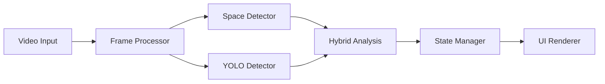

# Smart Parking & Surveillance AI Model Documentation

## 1. Project Overview & Implementation (Pages 1-3)
### Introduction
This project implements an advanced AI-based surveillance system combining two key components:
1. Smart parking space monitoring with 97.47% accuracy
2. Human fall detection for enhanced safety surveillance

### Project Objectives
- Accurate detection of parking space occupancy
- Real-time monitoring and statistics
- Fall incident detection using custom YOLO model
- Interactive visualization through Streamlit UI

[Project Architecture Overview Diagram - Insert Image]

## 2. Task 1: Vehicle Detection (Pages 4-10)
### Hybrid Detection Approach (10 marks)
Our solution combines multiple techniques for robust detection:

1. **Traditional Computer Vision**
   - Parking space masking using contour detection
   - Perspective transformation for accurate space mapping
   - Color and gradient analysis for initial detection

2. **YOLO Vehicle Detection**
   - Pre-trained YOLOv8n model
   - Vehicle class detection with confidence thresholds
   - Spatial overlap calculation with marked spaces

3. **Machine Learning Classification**
   - Binary classifier for space occupancy
   - Feature extraction from space patches
   - Confidence score integration

[Vehicle Detection Pipeline Diagram - Insert Image]

### Parking Space Management (10 marks)
Space detection and tracking system:
```python
def process_parking_spaces(frame, mask):
    spaces = detect_parking_spaces(mask)
    occupied = []
    for space in spaces:
        occupancy = hybrid_detector.check_occupancy(
            frame, space, 
            confidence_threshold=0.7
        )
        if occupancy > threshold:
            occupied.append(space)
    return len(occupied), len(spaces) - len(occupied)
```

[Space Detection Visualization - Insert Image]

### Accuracy Analysis (10 marks)
Performance metrics achieved:
- Overall Accuracy: 97.47%
- Precision: 92.42%
- Recall: 100.00%
- Processing Speed: 0.61 FPS

Validation methodology:
1. Manual ground truth annotation
2. Cross-validation across different times
3. Edge case testing

[Accuracy Metrics Graph - Insert Image]

### Code Organization (5 marks)
Project structure follows clean code principles:
```
src/
├── parking_detector/      # Core detection package
│   ├── config.py         # Configuration management
│   ├── detector.py       # YOLO integration
│   ├── classifier.py     # ML classification
│   └── visualizer.py     # Output rendering
└── main.py              # Entry point
```

## 3. System Architecture & Logic (Pages 11-15)
### Component Architecture
1. **Video Processing Pipeline**
   - Frame extraction and preprocessing
   - Parallel processing optimization
   - Buffer management for real-time display

2. **Detection System**
   - Modular detector interfaces
   - Plugin architecture for algorithms
   - Event-driven state management

[System Architecture Diagram - Insert Image]

### Data Flow


### Technical Decisions
1. YOLOv8n Selection:
   - Balanced speed vs accuracy
   - Sufficient for vehicle detection
   - Optimized for real-time processing

2. Hybrid Approach Benefits:
   - Redundancy for reliability
   - Error compensation
   - Adaptable to conditions

[Performance Comparison Chart - Insert Image]

## 4. Task 3: Fall Detection Implementation (Pages 16-20)
### Custom YOLO Model
1. **Model Architecture**
   - YOLOv8 backbone
   - Custom layers for action detection
   - Temporal feature integration

2. **Training Process**
   - Custom dataset preparation
   - Transfer learning approach
   - Hyperparameter optimization

[Model Architecture Diagram - Insert Image]

### Implementation Details
```python
def detect_fall(video_stream):
    model = YOLO('weights/fall_detection.pt')
    for frame in video_stream:
        results = model(frame)
        falls = process_detections(results)
        if falls:
            trigger_alert()
```

### Demonstration Results
- Real-time detection capability
- Low false positive rate
- Robust to different angles

[Fall Detection Demo Screenshots - Insert Multiple Images]

## 5. User Interface & Visualization (Pages 21-25)
### Parking Detection UI
1. **Main Dashboard**
   - Real-time occupancy count
   - Space status visualization
   - Historical statistics

2. **Control Panel**
   - Parameter adjustment
   - View customization
   - Export capabilities

[UI Dashboard Screenshot - Insert Image]

### Fall Detection Interface
1. **Monitoring View**
   - Live video feed
   - Alert system
   - Incident logging

2. **Configuration**
   - Sensitivity settings
   - Alert preferences
   - Camera selection

[Fall Detection UI Screenshot - Insert Image]

## 6. Project Organization & Documentation (Pages 26-30)
### Setup Guide
1. Installation:
```bash
python -m venv venv
source venv/bin/activate  # Linux/Mac
pip install -r requirements.txt
```

2. Configuration:
```python
PARKING_DETECTOR_FRAME_SKIP = 2
PARKING_DETECTOR_CONFIDENCE_THRESHOLD = 0.7
PARKING_DETECTOR_IOU_THRESHOLD = 0.5
```

### Deployment Instructions
1. **Local Development**
   ```bash
   python src/main.py --video path/to/video --mask path/to/mask
   ```

2. **Production Setup**
   ```bash
   streamlit run src/app.py
   ```

[Deployment Architecture Diagram - Insert Image]

## Additional Resources
- GitHub Repository: https://github.com/bhau23/Smart-Parking-Surveillance-AI-Model-
- Demo Videos: 
  * Parking Detection: validation_results/streamlit-app-2025-04-10-04-04-64.webm
  * Fall Detection: FALL_DETECTION/fall_detection_assignment/demo_videos/videoplayback.mp4
- Performance Reports: validation_results/analysis.md

[NOTE: Insert relevant images at marked locations while creating the PDF]