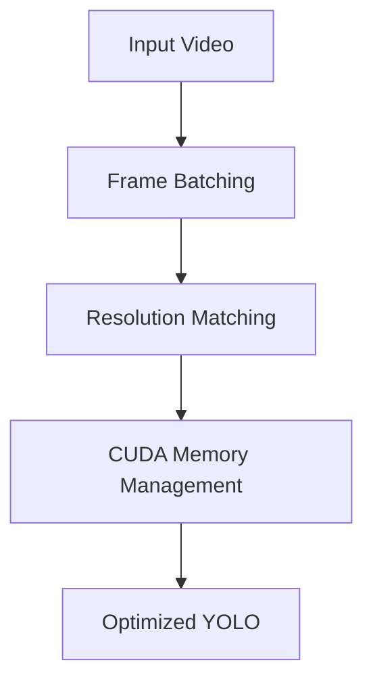
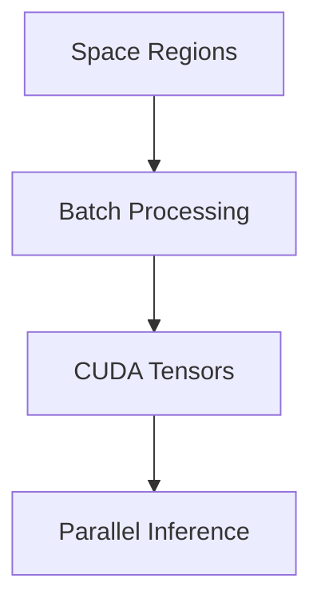
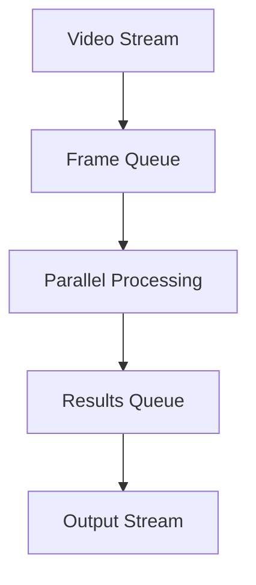
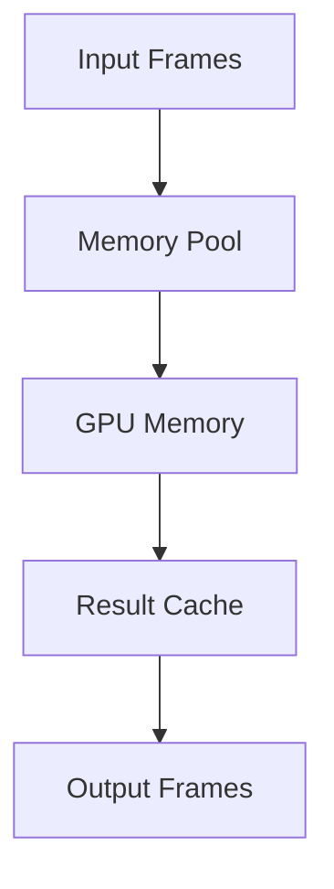

# Performance Optimization Plan

## Current Issues
1. YOLO detection running at low resolution (384x640)
2. Low FPS (4.93 frames per second)
3. No batch processing for multiple frames
4. CUDA acceleration not fully utilized

## Optimization Steps

### 1. YOLO Detection Optimization

#### Implementation Details:
- Set input size to match video resolution (1920x1080)
- Enable batched inference (process multiple frames at once)
- Implement CUDA memory pinning for faster GPU transfers
- Adjust confidence thresholds for faster inference

### 2. Classifier Optimization

#### Implementation Details:
- Convert classifier to PyTorch for GPU acceleration
- Implement batch processing for space regions
- Use CUDA tensors for faster computation

### 3. Pipeline Optimization

#### Implementation Details:
- Implement frame queue for continuous processing
- Use parallel processing for detector and classifier
- Optimize memory usage with proper buffer management
- Implement result caching for temporal consistency

### 4. Memory Management

#### Implementation Details:
- Implement memory pooling for frame buffers
- Optimize CUDA memory transfers
- Use pinned memory for faster CPU-GPU transfer
- Implement proper cleanup for GPU resources

## Expected Improvements
1. Target resolution: 1920x1080
2. Target FPS: >15 frames per second
3. Reduced memory usage
4. Better GPU utilization

## Implementation Priority
1. Resolution and batch size adjustment
2. Memory optimization
3. Pipeline parallelization
4. Result caching and temporal smoothing

Would you like me to write this optimization plan to a file and switch to Code mode to implement these improvements?